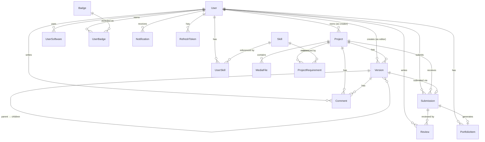
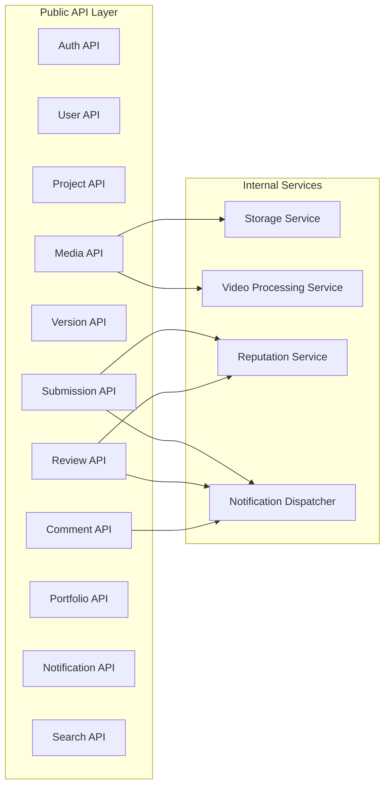
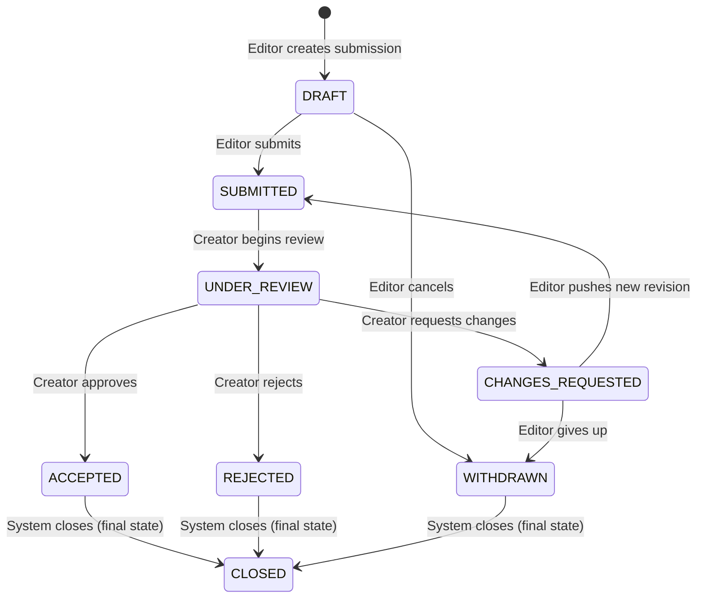

# EditHub — Product Requirements Document

> **Status**: Draft  
> **Author**: Lead Architect  
> **Last Updated**: 2026-08-30  
> **Purpose**: Define the complete requirements, domain model, and technical constraints before any implementation begins.

---

## Table of Contents

1. [Functional Requirements](#1-functional-requirements)
2. [Non-Functional Requirements](#2-non-functional-requirements)
3. [Core User Journeys](#3-core-user-journeys)
4. [Domain Entities](#4-domain-entities)
5. [Entity Relationships](#5-entity-relationships)
6. [API Boundaries](#6-api-boundaries)
7. [Security Requirements](#7-security-requirements)
8. [File Storage Requirements](#8-file-storage-requirements)
9. [Video Processing Requirements](#9-video-processing-requirements)
10. [MVP vs Future Features](#10-mvp-vs-future-features)
11. [Major Technical Risks](#11-major-technical-risks)
12. [Recommended Development Order](#12-recommended-development-order)

---

## 1. Functional Requirements

### 1.1 Authentication & Identity

| ID | Requirement | Priority |
|----|------------|----------|
| FR-AUTH-01 | Users can register with username, email, and password. | Must |
| FR-AUTH-02 | Users can log in with email and password. | Must |
| FR-AUTH-03 | The system issues a short-lived access token and a long-lived refresh token on login. | Must |
| FR-AUTH-04 | Access tokens can be refreshed without re-entering credentials. | Must |
| FR-AUTH-05 | Users can log out, which invalidates the current refresh token. | Must |
| FR-AUTH-06 | Users can request a password reset via email. | Should |
| FR-AUTH-07 | Email addresses must be verified before a user can create projects or submit edits. | Should |
| FR-AUTH-08 | OAuth login (Google, GitHub) is supported. | Could (Phase 2) |

### 1.2 User Profiles

| ID | Requirement | Priority |
|----|------------|----------|
| FR-USER-01 | Each user has a unique username and a public profile page. | Must |
| FR-USER-02 | Users select a primary role during registration: Creator, Editor, or Both. | Must |
| FR-USER-03 | Users can update their display name, bio, and avatar. | Must |
| FR-USER-04 | Editors can list skills from a predefined set (e.g., Color Grading, Sound Design). | Must |
| FR-USER-05 | Editors can list software proficiencies (e.g., DaVinci Resolve, Premiere Pro). | Must |
| FR-USER-06 | Users can add social/external links to their profile. | Should |
| FR-USER-07 | Users can follow other users. | Could (Phase 2) |
| FR-USER-08 | Profiles display a contribution summary: total submissions, accepted count, acceptance rate. | Must |

### 1.3 Video Projects

| ID | Requirement | Priority |
|----|------------|----------|
| FR-PROJ-01 | A creator can create a new video project with title, description, category, editing style, target platform, aspect ratio, target duration, deadline, and difficulty level. | Must |
| FR-PROJ-02 | A project has a visibility setting: Public, Unlisted, Private. | Must |
| FR-PROJ-03 | A project has a status lifecycle: Draft → Open → In Progress → Completed → Archived. | Must |
| FR-PROJ-04 | A creator can specify required skills and preferred software for the project. | Must |
| FR-PROJ-05 | A creator can write a free-form editing brief (the "README"). | Must |
| FR-PROJ-06 | A creator can edit any project metadata while the project is Open or In Progress. | Must |
| FR-PROJ-07 | A creator can soft-delete (archive) a project. Archiving does not destroy data. | Must |
| FR-PROJ-08 | A creator can set a license type for the project (e.g., Portfolio Allowed, Commercial Use). | Should |
| FR-PROJ-09 | A creator can attach an optional budget or bounty amount. | Could (Phase 2) |
| FR-PROJ-10 | A creator can invite specific editors to a Private project. | Should |
| FR-PROJ-11 | Public projects are visible to all authenticated users on the Explore page. | Must |
| FR-PROJ-12 | Unlisted projects are accessible only via direct link. They do not appear in search or explore. | Must |
| FR-PROJ-13 | Project status transitions are enforced: Draft→Open (requires ≥1 media file and a brief), Open→In Progress (automatic on first submission), In Progress→Completed (manual by creator), any→Archived (manual by creator). No backward transitions except Archived→Open. | Must |
| FR-PROJ-14 | When a project's visibility changes from Public/Unlisted to Private, existing in-progress submissions are not cancelled, but no new contributions are accepted from uninvited editors. | Must |

### 1.4 Media Management

| ID | Requirement | Priority |
|----|------------|----------|
| FR-MEDIA-01 | A creator can upload video, audio, and image files to a project. | Must |
| FR-MEDIA-02 | Uploads go directly from the browser to object storage using pre-signed URLs. Files must not pass through the application server. | Must |
| FR-MEDIA-03 | After a successful upload, the client notifies the backend, which records the file metadata (name, size, type, storage key, checksum). | Must |
| FR-MEDIA-04 | Files are organized logically within a project: raw footage, audio, assets. | Should |
| FR-MEDIA-05 | Authorized editors can generate time-limited download URLs for project media. | Must |
| FR-MEDIA-06 | A creator can delete media files from their own project. | Must |
| FR-MEDIA-07 | The system extracts basic metadata from uploaded video files (duration, resolution, codec) via a background worker. | Must |
| FR-MEDIA-08 | The system generates a thumbnail image for each uploaded video file. | Must |
| FR-MEDIA-09 | The system generates a low-resolution preview for each uploaded video file. | Should |
| FR-MEDIA-10 | Upload progress is visible to the user in the browser. | Must |
| FR-MEDIA-11 | Uploads support resumption if the connection drops (chunked/multipart upload). | Should |
| FR-MEDIA-12 | The upload completion endpoint (`/media/complete`) is idempotent. Calling it multiple times with the same `mediaId` and `checksum` produces the same result without re-triggering processing. | Must |

### 1.5 Version Control

| ID | Requirement | Priority |
|----|------------|----------|
| FR-VER-01 | When an editor contributes an edit, it creates a new **version** under the project. | Must |
| FR-VER-02 | Each version records: editor, title, description, parent version (if any), preview file, source project file, software used, and a summary of changes. | Must |
| FR-VER-03 | Versions form a tree. The root is the original project. Each editor's contribution branches from the root or from another version. | Must |
| FR-VER-04 | A version can have multiple child versions (revisions by the same editor, or branches by different editors). | Must |
| FR-VER-05 | The project page displays the version tree visually. | Must |
| FR-VER-06 | A version has a status: Draft, Submitted, Under Review, Accepted, Rejected. | Must |
| FR-VER-07 | An editor can continue editing a Draft version before submitting it. | Should |
| FR-VER-08 | Version data (metadata, preview, source file) is immutable after submission. | Must |

### 1.6 Edit Submissions

| ID | Requirement | Priority |
|----|------------|----------|
| FR-SUB-01 | An editor submits an edit by creating a submission linked to a version. | Must |
| FR-SUB-02 | A submission includes: title, description, version reference, software used, and a list of changes. | Must |
| FR-SUB-03 | A submission follows a state machine: Draft → Submitted → Under Review → (Accepted \| Changes Requested \| Rejected) → Closed. | Must |
| FR-SUB-04 | Only the project creator (or a maintainer) can transition a submission to Accepted, Changes Requested, or Rejected. | Must |
| FR-SUB-05 | When changes are requested, the editor can create a new revision (child version) and update the submission. The submission status transitions back to Submitted when the editor pushes a new version. | Must |
| FR-SUB-06 | When a submission is accepted, the version is marked as the accepted version of the project. | Must |
| FR-SUB-07 | A project can accept multiple submissions (e.g., accepting contributions from different editors for different aspects). | Should |
| FR-SUB-08 | A submission can be closed by the editor (withdrawn) or by the creator (declined). | Must |
| FR-SUB-09 | Concurrent reviews on the same submission are prevented using optimistic locking. If two reviewers attempt to transition the same submission simultaneously, the second request fails with a conflict error (HTTP 409). | Must |
| FR-SUB-10 | An editor can have at most one open (non-closed, non-rejected, non-accepted) submission per project at a time. | Must |

### 1.7 Review & Feedback

| ID | Requirement | Priority |
|----|------------|----------|
| FR-REV-01 | A creator can leave a review on a submission with a status (Approve, Request Changes, Reject) and written feedback. | Must |
| FR-REV-02 | A creator can rate an accepted submission on a 1–5 scale. | Should |
| FR-REV-03 | Review history is preserved. All reviews on a submission are visible as a timeline. | Must |
| FR-REV-04 | A creator can leave timeline-aware comments on a version: text linked to a specific video timestamp (seconds). | Must |
| FR-REV-05 | Comments support threading (replies). | Should |
| FR-REV-06 | Comments are visible on the version detail page, ordered by video timestamp or by creation time. | Must |

### 1.8 Portfolio & Reputation

| ID | Requirement | Priority |
|----|------------|----------|
| FR-PORT-01 | When a submission is accepted, the system automatically creates a portfolio item on the editor's profile. | Must |
| FR-PORT-02 | A portfolio item displays: project name, editor's role, tools used, and the creator's rating. | Must |
| FR-PORT-03 | An editor can toggle a portfolio item's visibility (public/private) and mark items as featured. | Should |
| FR-PORT-04 | An editor's profile page shows a contribution graph (similar to GitHub's heatmap) based on submission dates. | Should |
| FR-PORT-05 | The system calculates a reputation score based on: accepted contributions (weighted), average creator rating, acceptance rate, and consistency. | Should |
| FR-PORT-06 | The system awards badges based on milestones (e.g., First Contribution, 10 Accepted, Top Editor). | Could (Phase 2) |

### 1.9 Discovery & Search

| ID | Requirement | Priority |
|----|------------|----------|
| FR-DISC-01 | The Explore page lists all public, open projects. | Must |
| FR-DISC-02 | Users can search projects by keyword (matching title, description, skills, software). | Must |
| FR-DISC-03 | Users can filter projects by: category, editing style, required skills, software, difficulty, deadline status. | Must |
| FR-DISC-04 | Users can sort projects by: newest, trending (most recent submissions), most contributors. | Must |
| FR-DISC-05 | Search uses PostgreSQL full-text search. | Must |
| FR-DISC-06 | The system recommends projects to editors based on their skills and software. | Could (Phase 2) |
| FR-DISC-07 | All list endpoints are paginated. Default page size is 20. Maximum page size is 100. Responses include `page`, `size`, `totalElements`, `totalPages`. | Must |

### 1.10 Notifications

| ID | Requirement | Priority |
|----|------------|----------|
| FR-NOTIF-01 | Users receive in-app notifications for: new submission on their project, review posted, changes requested, submission accepted/rejected, new comment, new follower. | Must |
| FR-NOTIF-02 | Notifications have a read/unread state. | Must |
| FR-NOTIF-03 | Users can mark individual or all notifications as read. | Must |
| FR-NOTIF-04 | Notifications are delivered in real-time via WebSocket when the user is connected. | Should |
| FR-NOTIF-05 | Email notifications for critical events (submission accepted, changes requested). | Could (Phase 2) |

### 1.11 Fork / Remix

| ID | Requirement | Priority |
|----|------------|----------|
| FR-FORK-01 | A user can fork a public project, creating a new project that references the original. | Could (Phase 2) |
| FR-FORK-02 | Forked projects display a link to the original. | Could (Phase 2) |
| FR-FORK-03 | The original project displays a count and list of forks. | Could (Phase 2) |

### 1.12 Account Management

| ID | Requirement | Priority |
|----|------------|----------|
| FR-ACCT-01 | A user can deactivate their own account. Deactivation hides the profile and disables login but preserves data. | Should |
| FR-ACCT-02 | A user can request permanent account deletion. Deletion removes personal data but preserves anonymized contribution records ("Deleted User") so project history remains intact. | Should |
| FR-ACCT-03 | A user can change their password while logged in. | Must |

---

## 2. Non-Functional Requirements

### 2.1 Performance

| ID | Requirement | Target |
|----|------------|--------|
| NFR-PERF-01 | API response time for standard read endpoints (project detail, user profile, submission list). | p95 < 300ms |
| NFR-PERF-02 | API response time for write endpoints (create project, submit edit). | p95 < 500ms |
| NFR-PERF-03 | Pre-signed URL generation. | p95 < 100ms |
| NFR-PERF-04 | Search response time. | p95 < 500ms |
| NFR-PERF-05 | WebSocket notification delivery latency (server to connected client). | < 1 second |
| NFR-PERF-06 | Thumbnail generation after upload completion. | < 30 seconds |

### 2.2 Scalability

| ID | Requirement |
|----|------------|
| NFR-SCALE-01 | The system should handle individual file uploads of up to 10 GB. |
| NFR-SCALE-02 | The system should support at least 50 concurrent file uploads. |
| NFR-SCALE-03 | The system should support at least 500 concurrent API users. |
| NFR-SCALE-04 | Storage architecture should support petabyte-scale growth (object storage, not local disk). |
| NFR-SCALE-05 | Video processing workers should be independently scalable from the API server. |

### 2.3 Availability

| ID | Requirement | Target |
|----|------------|--------|
| NFR-AVAIL-01 | API availability target. | 99.5% (MVP), 99.9% (production) |
| NFR-AVAIL-02 | Object storage availability. | Delegated to S3/MinIO SLA |
| NFR-AVAIL-03 | Failed video processing jobs must be retried automatically (at least 3 attempts). | — |

### 2.4 Data Integrity

| ID | Requirement |
|----|------------|
| NFR-DATA-01 | All file uploads must be verified with checksums (SHA-256 or MD5). |
| NFR-DATA-02 | Database must be backed up daily with point-in-time recovery. |
| NFR-DATA-03 | Soft deletion is used for all user-facing data. No hard deletes in the MVP. |
| NFR-DATA-04 | Version history is append-only. Submitted versions cannot be modified or deleted. |

### 2.5 Observability

| ID | Requirement |
|----|------------|
| NFR-OBS-01 | Structured logging on all API requests (method, path, status, latency, user ID). |
| NFR-OBS-02 | Health check endpoint for load balancer probes. |
| NFR-OBS-03 | Metrics endpoint (Prometheus-compatible) for API latency, error rates, upload counts, queue depth. |
| NFR-OBS-04 | Video processing job status visible to operators (pending, processing, completed, failed). |

---

## 3. Core User Journeys

### 3.1 Creator Journey: Publish a Project

```
1. Creator registers (username, email, password, role = CREATOR or BOTH).
2. Creator verifies email.
3. Creator navigates to "Create Project."
4. Creator fills in project metadata:
   - Title, description, category, editing style
   - Target platform, aspect ratio, target duration
   - Deadline, difficulty
   - Required skills, preferred software
   - Visibility (Public / Unlisted / Private)
5. Creator saves as Draft.
6. Creator uploads raw footage and assets:
   - Selects files from local machine.
   - Frontend requests pre-signed upload URLs from the backend.
   - Frontend uploads directly to object storage.
   - Frontend notifies backend on each successful upload.
   - Backend records metadata and triggers processing (thumbnail, metadata extraction).
7. Creator writes the editing brief.
8. Creator reviews everything, then publishes (status: Draft → Open).
9. Project is now discoverable by editors (if Public) or accessible via link (if Unlisted).
```

**Preconditions**: User is registered and authenticated.  
**Postconditions**: A project exists with status=Open, with media files in object storage and metadata in the database.  
**Failure modes**: Upload interruption → user can retry. Missing required fields → validation error on publish.

### 3.2 Editor Journey: Discover, Edit, and Submit

```
1. Editor registers (username, email, password, role = EDITOR or BOTH).
2. Editor fills in profile: skills, software proficiencies.
3. Editor navigates to Explore.
4. Editor searches or filters projects (e.g., category=Travel, skill=Color Grading).
5. Editor finds an interesting project and opens the project page.
6. Editor reads the editing brief and reviews uploaded footage.
7. Editor downloads the raw footage/assets:
   - Frontend requests pre-signed download URLs from the backend.
   - Backend checks that the project is Open and the editor is authorized.
   - Frontend downloads files directly from object storage.
8. Editor edits the footage locally using their preferred software.
9. Editor returns to the project and starts a contribution:
   - Uploads the edited video (preview + optional source project file).
   - Fills in version metadata: title, description, software used, list of changes.
   - Saves as Draft (optional) or submits immediately.
10. Submission is created with status = Submitted.
11. Creator receives a notification.
```

**Preconditions**: Project exists with status=Open, editor is authenticated.  
**Postconditions**: A version and submission exist. Creator has a pending review.  
**Failure modes**: Upload failure → retry. Project closed between download and submit → submission rejected with clear message.

### 3.3 Creator Journey: Review and Accept

```
1. Creator receives a notification: "New submission on Goa Travel Reel."
2. Creator opens the submission page.
3. Creator watches the editor's preview video.
4. Creator compares against original footage (side-by-side or toggle).
5. Creator leaves timeline comments:
   - At 00:14: "Transition feels too fast."
   - At 00:32: "Increase subtitle size."
6. Creator sets the review status to "Changes Requested" with summary feedback.
7. Editor receives notification with the feedback.
8. Editor creates a new revision (child version), addressing the feedback.
9. Editor updates the submission with the new version.
10. Creator reviews again.
11. Creator sets review status to "Approved" and rates the contribution (4/5 stars).
12. Submission transitions to Accepted.
13. System creates a portfolio item on the editor's profile.
14. System updates the editor's reputation score and checks badge eligibility.
```

**Preconditions**: A submission exists in Submitted or resubmitted state.  
**Postconditions**: Submission is Accepted. Editor has a portfolio item. Reputation is updated.  
**Failure modes**: Creator accidentally rejects → they can re-review. Editor abandons revision → submission can be closed by either party.

### 3.4 Visitor Journey: View an Editor's Portfolio

```
1. Visitor (authenticated or not) navigates to an editor's profile via URL or search.
2. Profile page loads with:
   - Display name, avatar, bio.
   - Skills and software.
   - Contribution stats: submitted / accepted / acceptance rate.
   - Contribution graph (heatmap).
   - Featured portfolio items.
3. Visitor clicks a portfolio item to see the project and the editor's accepted contribution.
```

**Preconditions**: Editor has a public profile.  
**Postconditions**: None (read-only journey).

---

## 4. Domain Entities

### 4.1 Core Entities

| Entity | Description | Key Fields |
|--------|------------|------------|
| **User** | A registered human on the platform. Can act as Creator, Editor, or Both. | `id`, `username`, `email`, `passwordHash`, `displayName`, `bio`, `avatarUrl`, `role`, `reputation`, `isVerified`, `isActive`, `createdAt`, `updatedAt` |
| **Skill** | A reference item representing an editing competency. Seeded by the system. | `id`, `name`, `category` |
| **UserSkill** | Junction: a user's declared proficiency in a skill. | `id`, `userId`, `skillId`, `experienceLevel` |
| **UserSoftware** | A user's declared software proficiency. | `id`, `userId`, `name`, `proficiency` |
| **Project** | A video editing project created by a creator. The central domain object. | `id`, `ownerId`, `title`, `description`, `brief`, `category`, `editingStyle`, `targetPlatform`, `aspectRatio`, `targetDuration`, `deadline`, `difficulty`, `visibility`, `status`, `license`, `createdAt`, `updatedAt` |
| **ProjectRequirement** | Junction: a skill required for a project. | `id`, `projectId`, `skillId`, `isRequired` |
| **MediaFile** | A file (video, audio, image) uploaded to a project. Metadata only — binary lives in object storage. | `id`, `projectId`, `uploadedBy`, `fileName`, `storageKey`, `fileType`, `mimeType`, `fileSize`, `duration`, `width`, `height`, `thumbnailKey`, `checksum`, `status`, `createdAt` |
| **Version** | A snapshot of an editor's work. Forms a tree (parent → children). | `id`, `projectId`, `editorId`, `parentVersionId`, `versionNumber`, `title`, `description`, `previewKey`, `sourceFileKey`, `softwareUsed`, `changes`, `status`, `createdAt` |
| **Submission** | An editor's formal request for the creator to review a version. Analogous to a Pull Request. | `id`, `projectId`, `versionId`, `editorId`, `title`, `description`, `status`, `createdAt`, `updatedAt` |
| **Review** | A creator's evaluation of a submission. | `id`, `submissionId`, `reviewerId`, `status`, `rating`, `feedback`, `createdAt` |
| **Comment** | A comment on a version. Can be pinned to a video timestamp. Supports threading. | `id`, `projectId`, `versionId`, `userId`, `text`, `timestampSeconds`, `parentCommentId`, `createdAt` |
| **PortfolioItem** | A record of an accepted contribution on an editor's profile. | `id`, `userId`, `projectId`, `submissionId`, `title`, `description`, `role`, `toolsUsed`, `visibility`, `featured`, `thumbnailUrl`, `createdAt` |
| **Badge** | A milestone achievement definition. | `id`, `name`, `description`, `iconUrl`, `criteria` |
| **UserBadge** | Junction: a badge earned by a user. | `id`, `userId`, `badgeId`, `earnedAt` |
| **Notification** | An in-app notification for a user. | `id`, `userId`, `type`, `title`, `message`, `referenceId`, `referenceType`, `isRead`, `createdAt` |
| **RefreshToken** | A long-lived token for session renewal. Stored server-side for revocation. | `id`, `userId`, `token`, `expiresAt`, `createdAt` |

### 4.2 Enumerations

| Enum | Values |
|------|--------|
| **UserRole** | `CREATOR`, `EDITOR`, `BOTH`, `ADMIN` |
| **ExperienceLevel** | `BEGINNER`, `INTERMEDIATE`, `ADVANCED`, `EXPERT` |
| **ProjectVisibility** | `PUBLIC`, `UNLISTED`, `PRIVATE` |
| **ProjectStatus** | `DRAFT`, `OPEN`, `IN_PROGRESS`, `COMPLETED`, `ARCHIVED` |
| **ProjectDifficulty** | `BEGINNER`, `INTERMEDIATE`, `ADVANCED`, `EXPERT` |
| **MediaFileType** | `VIDEO`, `AUDIO`, `IMAGE`, `DOCUMENT`, `OTHER` |
| **MediaFileStatus** | `UPLOADING`, `PROCESSING`, `READY`, `FAILED` |
| **VersionStatus** | `DRAFT`, `SUBMITTED`, `UNDER_REVIEW`, `ACCEPTED`, `REJECTED` |
| **SubmissionStatus** | `DRAFT`, `SUBMITTED`, `UNDER_REVIEW`, `CHANGES_REQUESTED`, `ACCEPTED`, `REJECTED`, `WITHDRAWN`, `CLOSED` |
| **ReviewStatus** | `APPROVED`, `CHANGES_REQUESTED`, `REJECTED` |
| **NotificationType** | `SUBMISSION_RECEIVED`, `REVIEW_POSTED`, `CHANGES_REQUESTED`, `SUBMISSION_ACCEPTED`, `SUBMISSION_REJECTED`, `NEW_COMMENT`, `MENTION`, `BADGE_EARNED` |

---

## 5. Entity Relationships



### Key Relationship Constraints

1. **Project → User (owner)**: Many-to-one. A project has exactly one owner. A user can own many projects.
2. **Version → Project**: Many-to-one. A project has many versions. The first version is implicit (the original footage).
3. **Version → Version (parent)**: Self-referential. Nullable. Root versions have no parent. This forms a tree, not a graph — a version has at most one parent.
4. **Version → User (editor)**: Many-to-one. Each version is created by one editor.
5. **Submission → Version**: One-to-one. A submission references exactly one version. A version can have at most one submission.
6. **Submission → Project**: Many-to-one. A project can have many submissions from different editors.
7. **Review → Submission**: Many-to-one. A submission can have multiple reviews (e.g., initial review, then review after revision).
8. **Comment → Version**: Many-to-one. Comments are scoped to a version, not the project overall. `timestampSeconds` is nullable — general comments have no timestamp.
9. **Comment → Comment (parent)**: Self-referential. Nullable. Enables threading.
10. **PortfolioItem → Submission**: One-to-one. Created automatically when a submission is accepted.
11. **MediaFile → Project**: Many-to-one. Belongs to one project. Cannot be shared across projects.

---

## 6. API Boundaries

The backend is organized as a **modular monolith**. Each module owns its entities, services, and controllers. Modules communicate via direct Java method calls (not HTTP or message queues).

### 6.1 Module Map



### 6.2 API Endpoints

#### Auth Module

| Method | Path | Description | Auth |
|--------|------|------------|------|
| POST | `/api/v1/auth/register` | Register a new user. | No |
| POST | `/api/v1/auth/login` | Authenticate and receive tokens. | No |
| POST | `/api/v1/auth/refresh` | Refresh the access token. | Refresh token |
| POST | `/api/v1/auth/logout` | Invalidate the refresh token. | Yes |

#### User Module

| Method | Path | Description | Auth |
|--------|------|------------|------|
| GET | `/api/v1/users/me` | Get the authenticated user's full profile. | Yes |
| PATCH | `/api/v1/users/me` | Update the authenticated user's profile. | Yes |
| GET | `/api/v1/users/{username}` | Get a user's public profile. | No |
| GET | `/api/v1/users/{username}/stats` | Get a user's contribution statistics. | No |
| GET | `/api/v1/skills` | List all available skills. | No |
| PUT | `/api/v1/users/me/skills` | Set the authenticated user's skills. | Yes |
| PUT | `/api/v1/users/me/software` | Set the authenticated user's software. | Yes |

#### Project Module

| Method | Path | Description | Auth |
|--------|------|------------|------|
| POST | `/api/v1/projects` | Create a new project. | Yes (Creator) |
| GET | `/api/v1/projects/{id}` | Get project details. | Conditional |
| PATCH | `/api/v1/projects/{id}` | Update project metadata. | Yes (Owner) |
| DELETE | `/api/v1/projects/{id}` | Archive a project (soft delete). | Yes (Owner) |
| POST | `/api/v1/projects/{id}/publish` | Transition from Draft to Open. | Yes (Owner) |
| GET | `/api/v1/projects/{id}/contributors` | List editors who have submitted. | Conditional |

#### Media Module

| Method | Path | Description | Auth |
|--------|------|------------|------|
| POST | `/api/v1/projects/{id}/media/upload-url` | Generate a pre-signed upload URL. | Yes (Owner) |
| POST | `/api/v1/projects/{id}/media/complete` | Confirm upload completion. Triggers processing. | Yes (Owner) |
| GET | `/api/v1/projects/{id}/media` | List project media files with metadata. | Conditional |
| GET | `/api/v1/media/{id}/download-url` | Generate a pre-signed download URL. | Conditional |
| DELETE | `/api/v1/media/{id}` | Delete a media file. | Yes (Owner) |

#### Version Module

| Method | Path | Description | Auth |
|--------|------|------------|------|
| POST | `/api/v1/projects/{id}/versions` | Create a new version (starts a contribution). | Yes (Editor) |
| GET | `/api/v1/projects/{id}/versions` | List all versions (tree). | Conditional |
| GET | `/api/v1/versions/{id}` | Get version details. | Conditional |
| POST | `/api/v1/versions/{id}/upload-url` | Generate pre-signed URL for version preview/source. | Yes (Version owner) |
| POST | `/api/v1/versions/{id}/complete-upload` | Confirm version file upload. | Yes (Version owner) |

#### Submission Module

| Method | Path | Description | Auth |
|--------|------|------------|------|
| POST | `/api/v1/projects/{id}/submissions` | Create a submission from a version. | Yes (Editor) |
| GET | `/api/v1/projects/{id}/submissions` | List submissions for a project. | Conditional |
| GET | `/api/v1/submissions/{id}` | Get submission details. | Conditional |
| POST | `/api/v1/submissions/{id}/submit` | Transition from Draft to Submitted. | Yes (Submitter) |
| POST | `/api/v1/submissions/{id}/withdraw` | Withdraw a submission. | Yes (Submitter) |

#### Review Module

| Method | Path | Description | Auth |
|--------|------|------------|------|
| POST | `/api/v1/submissions/{id}/reviews` | Post a review. | Yes (Project Owner) |
| GET | `/api/v1/submissions/{id}/reviews` | List reviews on a submission. | Conditional |
| POST | `/api/v1/submissions/{id}/accept` | Accept the submission. | Yes (Project Owner) |
| POST | `/api/v1/submissions/{id}/reject` | Reject the submission. | Yes (Project Owner) |
| POST | `/api/v1/submissions/{id}/request-changes` | Request changes on the submission. | Yes (Project Owner) |

#### Comment Module

| Method | Path | Description | Auth |
|--------|------|------------|------|
| POST | `/api/v1/versions/{id}/comments` | Post a comment (optionally with `timestampSeconds`). | Yes |
| GET | `/api/v1/versions/{id}/comments` | List comments on a version. | Conditional |
| DELETE | `/api/v1/comments/{id}` | Delete own comment. | Yes (Author) |

#### Portfolio Module

| Method | Path | Description | Auth |
|--------|------|------------|------|
| GET | `/api/v1/users/{username}/portfolio` | Get a user's portfolio items. | No |
| PATCH | `/api/v1/portfolio/{id}` | Update visibility, featured status, description. | Yes (Owner) |

#### Notification Module

| Method | Path | Description | Auth |
|--------|------|------------|------|
| GET | `/api/v1/notifications` | List notifications for the authenticated user. | Yes |
| PATCH | `/api/v1/notifications/{id}/read` | Mark a notification as read. | Yes |
| POST | `/api/v1/notifications/read-all` | Mark all notifications as read. | Yes |
| WS | `/ws/notifications` | WebSocket for real-time notification delivery. | Yes |

#### Search Module

| Method | Path | Description | Auth |
|--------|------|------------|------|
| GET | `/api/v1/search/projects` | Search projects by keyword + filters. | No |
| GET | `/api/v1/search/editors` | Search editors by skill/software. | No |

### 6.3 Authorization Rules — "Conditional" Access

"Conditional" in the table above means:

- **Public project**: Any authenticated user can read.
- **Unlisted project**: Any authenticated user with the project ID can read.
- **Private project**: Only the owner and invited editors can read.
- **Draft project**: Only the owner can read.
- **Version/Submission on a project**: Same rules as the parent project.

---

## 7. Security Requirements

### 7.1 Authentication

| ID | Requirement |
|----|------------|
| SEC-AUTH-01 | Passwords are hashed with BCrypt (cost factor ≥ 12). |
| SEC-AUTH-02 | Access tokens are JWTs with a 15-minute expiry. Signed with HMAC-SHA256 using a server-side secret. |
| SEC-AUTH-03 | Refresh tokens are opaque random strings, stored in the database, with a 7-day expiry. |
| SEC-AUTH-04 | Refresh tokens are single-use. Using a refresh token issues a new refresh token and invalidates the old one. |
| SEC-AUTH-05 | Logout invalidates the user's current refresh token. |
| SEC-AUTH-06 | JWT claims include: `sub` (user ID), `username`, `role`, `iat`, `exp`. |

### 7.2 Authorization

| ID | Requirement |
|----|------------|
| SEC-AUTHZ-01 | Every mutating endpoint checks that the authenticated user has the required relationship (owner, editor, submitter, etc.). |
| SEC-AUTHZ-02 | Project-level roles are implicit based on ownership and contribution, not a separate role table in the MVP. The owner is always the only user who can accept/reject. |
| SEC-AUTHZ-03 | Admin role can moderate any content. Admin endpoints are separated by path prefix: `/api/v1/admin/...`. |

### 7.3 File Security

| ID | Requirement |
|----|------------|
| SEC-FILE-01 | All upload and download URLs are pre-signed with a short expiry (default: 60 minutes). |
| SEC-FILE-02 | The backend validates that the requesting user is authorized for the project before issuing a pre-signed URL. |
| SEC-FILE-03 | Object storage buckets for raw media are **not** publicly accessible. Only the thumbnail and preview buckets may have public read access. |
| SEC-FILE-04 | Uploaded file types are validated against an allowlist: `mp4`, `mov`, `avi`, `mkv`, `webm` (video); `wav`, `mp3`, `aac`, `flac` (audio); `png`, `jpg`, `jpeg`, `svg`, `gif` (image); `ttf`, `otf`, `woff` (font); `zip` (archive). |
| SEC-FILE-05 | Maximum file size is enforced at the pre-signed URL level (S3 content-length condition) and validated again on completion. |

### 7.4 Input Validation & Abuse Prevention

| ID | Requirement |
|----|------------|
| SEC-INPUT-01 | All API inputs are validated using Jakarta Bean Validation annotations. |
| SEC-INPUT-02 | Text fields are sanitized to prevent XSS (HTML entities escaped). |
| SEC-INPUT-03 | Rate limiting on authentication endpoints: max 10 login attempts per IP per minute. |
| SEC-INPUT-04 | Rate limiting on upload URL generation: max 100 per user per hour. |
| SEC-INPUT-05 | Rate limiting on submission creation: max 10 per user per project per day. |
| SEC-INPUT-06 | CORS is restricted to the frontend origin in production. |

---

## 8. File Storage Requirements

### 8.1 Storage Architecture

```
Object Storage (S3-compatible)
│
├── edithub-media/                          # Private bucket
│   └── projects/
│       └── {projectId}/
│           ├── raw/                        # Creator's raw footage
│           │   ├── {mediaId}_{filename}
│           │   └── ...
│           ├── assets/                     # Creator's assets (logos, fonts)
│           │   └── {mediaId}_{filename}
│           └── versions/                   # Editor submissions
│               └── {versionId}/
│                   ├── preview.mp4         # Rendered preview
│                   └── source.zip          # Source project file (optional)
│
├── edithub-thumbnails/                     # Public-read bucket
│   └── projects/
│       └── {projectId}/
│           ├── {mediaId}_thumb.jpg
│           └── versions/
│               └── {versionId}_thumb.jpg
│
└── edithub-previews/                       # Public-read bucket
    └── projects/
        └── {projectId}/
            └── {mediaId}_preview.mp4       # Low-res preview
```

### 8.2 Upload Flow

```
Step 1: Client requests upload URL
        POST /api/v1/projects/{id}/media/upload-url
        Body: { fileName, fileSize, mimeType, checksum }
        → Backend validates auth, project ownership, file type, file size
        → Backend generates a storage key
        → Backend creates a MediaFile record with status=UPLOADING
        → Backend generates a pre-signed PUT URL with content-length and content-type conditions
        → Returns: { uploadUrl, mediaId, storageKey }

Step 2: Client uploads directly to object storage
        PUT {uploadUrl}
        Body: raw file bytes
        → Client tracks progress via XHR/fetch progress events

Step 3: Client confirms completion
        POST /api/v1/projects/{id}/media/complete
        Body: { mediaId, checksum }
        → Backend verifies the object exists in storage
        → Backend verifies file size and checksum match
        → Backend updates MediaFile status to PROCESSING
        → Backend enqueues a video processing job

Step 4: Worker processes the file
        → Extract metadata (duration, resolution, codec)
        → Generate thumbnail
        → Generate low-res preview (optional)
        → Update MediaFile status to READY
```

### 8.3 Download Flow

```
Step 1: Client requests download URL
        GET /api/v1/media/{id}/download-url
        → Backend validates auth and project access
        → Backend generates a pre-signed GET URL (60-minute expiry)
        → Returns: { downloadUrl, fileName, fileSize }

Step 2: Client downloads directly from object storage
        GET {downloadUrl}
```

### 8.4 Storage Constraints

| Constraint | Value |
|-----------|-------|
| Max file size (MVP) | 10 GB |
| Max total project size (MVP) | 50 GB |
| Pre-signed URL expiry | 60 minutes |
| Allowed video formats | mp4, mov, avi, mkv, webm |
| Allowed audio formats | wav, mp3, aac, flac |
| Allowed image formats | png, jpg, jpeg, svg, gif |
| Thumbnail format | JPEG, 640×360, quality 80 |
| Preview format | MP4 (H.264), 720p, CRF 28 |

---

## 9. Video Processing Requirements

### 9.1 Processing Pipeline

Video processing is handled by a **separate worker process** that shares the database and object storage with the main API. In the MVP, the worker polls a Redis queue for jobs. The API never processes video directly.

```
┌─────────┐     ┌───────────┐     ┌──────────────┐     ┌─────────┐
│ API     │────▶│ Redis     │────▶│ Video Worker │────▶│ Object  │
│ Server  │     │ Queue     │     │ (FFmpeg)     │     │ Storage │
└─────────┘     └───────────┘     └──────────────┘     └─────────┘
                                         │
                                         ▼
                                  ┌─────────────┐
                                  │ PostgreSQL   │
                                  │ (update      │
                                  │  metadata)   │
                                  └─────────────┘
```

### 9.2 Job Types

| Job | Input | Output | MVP? |
|-----|-------|--------|------|
| **Metadata Extraction** | Video file in S3 | Duration, resolution, codec, fps, bitrate written to `media_files` table | Yes |
| **Thumbnail Generation** | Video file in S3 | JPEG thumbnail at 25% mark, uploaded to thumbnails bucket | Yes |
| **Preview Generation** | Video file in S3 | 720p MP4 preview, uploaded to previews bucket | Phase 2 |
| **Waveform Generation** | Audio/video file in S3 | Waveform data (JSON array of amplitude values) | Phase 2 |
| **Format Validation** | Any uploaded file | Verify file is a valid media file, not corrupted | Yes |

### 9.3 FFmpeg Commands (Reference)

```bash
# Metadata extraction
ffprobe -v quiet -print_format json -show_format -show_streams {input}

# Thumbnail at 25% of duration
ffmpeg -ss {duration*0.25} -i {input} -vframes 1 -q:v 2 -vf "scale=640:-1" {output.jpg}

# Low-res preview
ffmpeg -i {input} -vf "scale=-2:720" -c:v libx264 -crf 28 -preset fast -c:a aac -b:a 128k {output.mp4}
```

### 9.4 Worker Behavior

- Worker starts as a separate process (Docker container or background thread).
- Worker polls Redis list (`edithub:video:queue`) using `BLPOP`.
- On receiving a job, worker downloads the file from S3 to a temporary directory.
- Worker runs FFmpeg commands.
- Worker uploads outputs (thumbnail, preview) to S3.
- Worker updates the `media_files` row with extracted metadata and status=READY.
- On failure: worker retries up to 3 times with exponential backoff, then marks status=FAILED.
- Worker cleans up temporary files after each job.

---

## 10. MVP vs Future Features

### 10.1 MVP (Must Have for Launch)

| Area | Features |
|------|----------|
| **Auth** | Register, login, JWT tokens, refresh, logout |
| **Profiles** | Public profile, bio, avatar, skills, software |
| **Projects** | Create, edit, publish, archive. Public/Unlisted/Private visibility. Editing brief. |
| **Media** | Upload via pre-signed URLs, list, download, delete. Thumbnails and metadata extraction. |
| **Versioning** | Create versions, version tree, link parent versions |
| **Submissions** | Create, submit, state machine (Draft → Submitted → Under Review → Accepted/Rejected/Changes Requested) |
| **Reviews** | Creator review with feedback, accept, reject, request changes |
| **Comments** | Timeline-aware comments on versions (with `timestampSeconds`), threading |
| **Portfolio** | Auto-generated on acceptance, public portfolio page |
| **Search** | PostgreSQL full-text search on projects, basic filters |
| **Notifications** | In-app notifications for key events, read/unread state |
| **Discovery** | Explore page with filters and sorting |

### 10.2 Phase 2 (Post-MVP)

| Feature | Rationale for deferral |
|---------|----------------------|
| OAuth login (Google, GitHub) | Not essential for core loop. Email/password is sufficient for MVP. |
| Email notifications | Requires email service integration (SES, SendGrid). |
| Follow system | Social feature, not core to the edit → review → accept loop. |
| Fork / Remix | Interesting but not required for the primary contribution workflow. |
| Badges | Gamification is a retention feature, not a launch feature. |
| Contribution graph (heatmap) | Nice-to-have visualization. Portfolio list is sufficient for MVP. |
| Editor recommendation / matching | Requires data. The system needs projects and editors before matching is meaningful. |
| Low-res preview generation | Thumbnails are sufficient. Full preview transcoding adds infra cost. |
| Advanced project permissions (Maintainer role) | Owner-only review is sufficient for MVP. |
| Project invitations (Private projects) | Unlisted + link sharing covers the 80% case. |

### 10.3 Phase 3 (Later)

| Feature |
|---------|
| Bounties and payments |
| Tips |
| Teams / workspaces |
| Advanced analytics |
| AI editing brief generation |
| AI editor matching |
| AI footage analysis |
| Browser-based video preview editing |
| Elasticsearch / OpenSearch |

---

## 11. Major Technical Risks

### Risk 1: Large File Upload Reliability

| | |
|-|-|
| **Description** | Video files can be several GB. Browser uploads over unreliable connections will fail. |
| **Impact** | High. Core workflow breaks if uploads fail. |
| **Mitigation** | Use S3 multipart upload. Implement chunked upload on the frontend with retry per chunk. Show upload progress. Allow resumption from the last successful chunk. |
| **Residual risk** | Multipart upload adds frontend complexity. Must be tested with real-world file sizes. |

### Risk 2: Storage Cost Growth

| | |
|-|-|
| **Description** | Video files are large. Each project may have multiple versions. Storage costs can grow quickly. |
| **Impact** | High. Could make the platform economically unviable. |
| **Mitigation** | Store only metadata + changed assets per version, not full duplicates. Set per-project storage limits. Implement storage quotas. Monitor storage usage. Defer preview generation (which doubles storage) to Phase 2. |
| **Residual risk** | Even with optimization, a successful platform will accumulate significant storage. Pricing/quota policy must be defined before launch. |

### Risk 3: Video Processing Worker Failure

| | |
|-|-|
| **Description** | FFmpeg processing can fail due to corrupt files, unsupported codecs, or resource exhaustion. |
| **Impact** | Medium. A failed processing job means no thumbnail and no metadata, degrading the user experience. |
| **Mitigation** | Retry with backoff (3 attempts). Mark files as FAILED after exhausting retries. Allow manual re-trigger. Validate file format on upload (before processing). Set resource limits on the worker container. |
| **Residual risk** | Some files will fail processing. The UI must handle FAILED status gracefully. |

### Risk 4: Version Tree Complexity

| | |
|-|-|
| **Description** | The version tree is a recursive data structure. Rendering it in the UI and querying it efficiently requires care. |
| **Impact** | Medium. Poor implementation can lead to N+1 queries or an unusable UI. |
| **Mitigation** | Use a recursive CTE (Common Table Expression) in PostgreSQL to fetch the full tree in a single query. Use a well-tested tree visualization library on the frontend. Cap tree depth (e.g., max 20 levels). |
| **Residual risk** | Very large trees (hundreds of versions) may require pagination or lazy loading. |

### Risk 5: Pre-Signed URL Security

| | |
|-|-|
| **Description** | Pre-signed URLs grant direct access to object storage. If leaked, anyone can download the file until the URL expires. |
| **Impact** | Medium. Unauthorized access to raw footage. |
| **Mitigation** | Short URL expiry (60 minutes). Generate URLs on demand, never cache. Log URL generation for auditing. Consider IP-based access restrictions if supported by the storage provider. |
| **Residual risk** | A valid URL can be shared within its expiry window. Acceptable for MVP given short expiry. |

### Risk 6: Copyright and Ownership Disputes

| | |
|-|-|
| **Description** | Creators upload footage they may not own. Editors submit work that incorporates copyrighted assets. Ownership of the final edit is ambiguous. |
| **Impact** | High (legal). Could expose the platform to liability. |
| **Mitigation** | Require creators to affirm ownership at upload. Define clear Terms of Service and Contribution License Agreement. Display license terms prominently on each project. Add a report/DMCA workflow. Do NOT auto-publish accepted edits externally. |
| **Residual risk** | Legal risk is never fully mitigated by technical controls. Legal counsel should review ToS before launch. |

### Risk 7: Submission State Machine Integrity

| | |
|-|-|
| **Description** | The submission lifecycle has many states and transitions. Invalid transitions (e.g., accepting an already-rejected submission) must be prevented. |
| **Impact** | Medium. Data corruption if states are inconsistent. |
| **Mitigation** | Implement the state machine explicitly in the service layer with a transition table. Reject invalid transitions with clear error messages. Use optimistic locking (`@Version`) to prevent race conditions on concurrent reviews. |
| **Residual risk** | Low, if the state machine is tested thoroughly. |

### Risk 8: Database Performance Under Load

| | |
|-|-|
| **Description** | Full-text search, version tree queries, and notification queries can become slow on large datasets. |
| **Impact** | Medium. Degraded user experience. |
| **Mitigation** | Add appropriate indexes from the start (GIN for full-text, B-tree for foreign keys, composite indexes for common queries). Use Redis caching for hot data (trending projects, user profiles). Monitor query performance with `pg_stat_statements`. |
| **Residual risk** | At scale, PostgreSQL full-text search may need to be replaced with a dedicated search engine. |

---

## 12. Recommended Development Order

The development order is designed so that each phase produces a demonstrable increment of the core product loop, and each phase depends only on what was built before it.

### Phase 1: Foundation

**Goal**: A running application with authentication and user profiles.

| Step | What | Why first |
|------|------|-----------|
| 1.1 | Infrastructure: Docker Compose (PostgreSQL, Redis, MinIO) | Every subsequent step depends on running infrastructure. |
| 1.2 | Backend: Spring Boot project scaffold, configuration, Flyway setup | Must exist before any module. |
| 1.3 | Backend: User entity, database migration | All modules reference users. |
| 1.4 | Backend: Auth module (register, login, JWT, refresh, logout) | All subsequent API endpoints require authentication. |
| 1.5 | Backend: User profile module (get/update profile, skills, software) | Editors need profiles before contributing. |
| 1.6 | Frontend: Next.js scaffold, Tailwind, design system, layout | All pages depend on the shell. |
| 1.7 | Frontend: API client, auth context, token management | All pages depend on auth state. |
| 1.8 | Frontend: Login, Register, Profile, Settings pages | Users must be able to create accounts and set up profiles. |

**Demo**: User registers → logs in → updates profile with skills and bio → views public profile.

---

### Phase 2: Projects

**Goal**: Creators can create, publish, and manage video projects. Editors can discover and browse them.

| Step | What | Depends on |
|------|------|------------|
| 2.1 | Backend: Skill reference table migration + seed data | Phase 1 |
| 2.2 | Backend: Project entity, migrations, CRUD endpoints | Phase 1 |
| 2.3 | Backend: ProjectRequirement entity (skills per project) | 2.2 |
| 2.4 | Backend: Project search and filtering (PostgreSQL full-text) | 2.2 |
| 2.5 | Frontend: Project creation wizard | 2.2 |
| 2.6 | Frontend: Project detail page (overview tab) | 2.2 |
| 2.7 | Frontend: Explore page with search and filters | 2.4 |

**Demo**: Creator creates "Goa Travel Reel" project → publishes it → editor finds it on Explore → views project details.

---

### Phase 3: Media Upload

**Goal**: Creators can upload large files directly to object storage. Files are processed in the background.

| Step | What | Depends on |
|------|------|------------|
| 3.1 | Backend: S3/MinIO storage service (pre-signed URL generation) | Phase 1 |
| 3.2 | Backend: MediaFile entity, migrations, upload/complete/list/delete endpoints | Phase 2 |
| 3.3 | Video Worker: Redis queue consumer, FFmpeg metadata extraction, thumbnail generation | 3.2 |
| 3.4 | Frontend: File uploader component (drag-and-drop, progress, chunked upload) | 3.2 |
| 3.5 | Frontend: Media gallery on project page (Files tab) | 3.2 |
| 3.6 | Frontend: Download flow for editors | 3.2 |

**Demo**: Creator uploads 3 video files and a voiceover → thumbnails appear → editor downloads footage.

---

### Phase 4: Versioning and Submissions

**Goal**: Editors can contribute edits. The version tree takes shape. Submissions enter the review pipeline.

| Step | What | Depends on |
|------|------|------------|
| 4.1 | Backend: Version entity, migrations, CRUD, tree query (recursive CTE) | Phase 3 |
| 4.2 | Backend: Version file upload (reuse pre-signed URL flow for preview/source files) | 4.1 |
| 4.3 | Backend: Submission entity, migrations, state machine, CRUD | 4.1 |
| 4.4 | Frontend: Contribute page (upload edit, describe changes, submit) | 4.1, 4.2 |
| 4.5 | Frontend: Version tree visualization on project page | 4.1 |
| 4.6 | Frontend: Submission list on project page | 4.3 |

**Demo**: Editor uploads an edit → version appears in tree → submission is created with status=Submitted.

---

### Phase 5: Review Workflow

**Goal**: Creators can review, request changes, and accept submissions. The core loop closes.

| Step | What | Depends on |
|------|------|------------|
| 5.1 | Backend: Review entity, migrations, review endpoints | Phase 4 |
| 5.2 | Backend: Accept/Reject/Request-Changes logic (submission state transitions) | 5.1 |
| 5.3 | Backend: Comment entity, migrations, CRUD (with `timestampSeconds`) | Phase 4 |
| 5.4 | Frontend: Submission review page (video player, comparison, review form) | 5.1, 5.2 |
| 5.5 | Frontend: Timeline comments (add at timestamp, seek on click) | 5.3 |
| 5.6 | Frontend: Creator dashboard (my projects, pending reviews) | 5.2 |

**Demo**: Creator watches submitted edit → adds timeline comment at 00:14 → requests changes → editor revises → creator accepts → submission is merged.

---

### Phase 6: Portfolio and Reputation

**Goal**: Accepted contributions appear on editor profiles. Reputation scores are computed.

| Step | What | Depends on |
|------|------|------------|
| 6.1 | Backend: PortfolioItem entity, auto-creation on submission acceptance | Phase 5 |
| 6.2 | Backend: Portfolio endpoints (list, update visibility, feature) | 6.1 |
| 6.3 | Backend: Reputation scoring service | 6.1 |
| 6.4 | Frontend: Portfolio section on profile page | 6.2 |
| 6.5 | Frontend: Contribution stats on profile page | 6.3 |

**Demo**: After acceptance, editor's profile shows the contribution. Reputation score is visible.

---

### Phase 7: Notifications

**Goal**: Users are notified of relevant events in real-time.

| Step | What | Depends on |
|------|------|------------|
| 7.1 | Backend: Notification entity, migrations, CRUD | Phase 5 |
| 7.2 | Backend: Notification dispatch (on submission, review, comment, acceptance) | 7.1 |
| 7.3 | Backend: WebSocket endpoint for real-time push | 7.1 |
| 7.4 | Frontend: Notification bell in navbar with unread count | 7.1, 7.3 |
| 7.5 | Frontend: Notification dropdown/page | 7.4 |

**Demo**: Creator submits a review → editor receives a real-time notification → clicks to view.

---

### Phase 8: Polish and Harden

**Goal**: The product is production-ready.

| Step | What | Depends on |
|------|------|------------|
| 8.1 | Security: Rate limiting, input validation audit, CORS hardening | All |
| 8.2 | Testing: Unit tests for services, integration tests for controllers | All |
| 8.3 | Frontend: Landing page, empty states, error states, loading skeletons | All |
| 8.4 | Frontend: Responsive design, accessibility, SEO tags | All |
| 8.5 | Infrastructure: Production Docker Compose / deployment scripts | All |
| 8.6 | Observability: Health checks, metrics, structured logging | All |

**Demo**: Full end-to-end walkthrough from sign-up to portfolio. Run on staging environment.

---

## Appendix A: Glossary

| Term | Definition |
|------|-----------|
| **Creator** | A user who creates video projects and reviews contributions. |
| **Editor** | A user who discovers projects, contributes edits, and builds a portfolio. |
| **Project** | A container for raw footage, assets, requirements, versions, and submissions. Analogous to a GitHub repository. |
| **Brief** | The editing requirements document attached to a project. Analogous to a README. |
| **Version** | A snapshot of an editor's work. Versions form a tree. Analogous to a Git branch + commit. |
| **Submission** | A formal request for the creator to review a version. Analogous to a Pull Request. |
| **Review** | A creator's evaluation of a submission (approve, request changes, reject). |
| **Timeline Comment** | A comment linked to a specific timestamp in a video. |
| **Portfolio** | An editor's public collection of accepted contributions. |
| **Pre-signed URL** | A time-limited URL that grants direct access to an object in S3-compatible storage. |

## Appendix B: Open Decisions

These items require explicit decision before or during implementation:

| # | Decision | Options | Impact |
|---|----------|---------|--------|
| 1 | **Password reset**: Email-based? In-app only? | (a) Email with reset link (b) Admin-reset only for MVP | Requires email service for (a). |
| 2 | **Email verification**: Required for what actions? | (a) Required before any project creation or submission (b) Not required for MVP | Risk of spam accounts without verification. |
| 3 | **Max file size**: What limit? | 5 GB, 10 GB, or no hard limit? | Affects pre-signed URL config and storage costs. |
| 4 | **Video worker technology**: Java or Python? | (a) Java (consistent with backend) (b) Python (easier FFmpeg scripting) | Python is more common for FFmpeg scripting. Java keeps the stack uniform. |
| 5 | **Frontend state management**: React Query, Zustand, or Redux? | (a) React Query for server state + Zustand for client state (b) React Query only | Affects frontend architecture. |
| 6 | **Deployment target**: Where will the MVP run? | Cloud managed services vs. self-hosted Docker Compose on a VPS. | Affects infrastructure code. |
| 7 | **Contribution license**: What license is implied when an editor submits? | Must be defined in Terms of Service before launch. | Legal requirement. |
| 8 | **Avatar upload**: Use object storage or a third-party service (Gravatar, Cloudinary)? | (a) Object storage (consistent) (b) Gravatar (simpler) | Affects upload flow and storage costs. |

---

## Appendix C: Submission State Machine



### Valid Transitions

| From | To | Actor | Condition |
|------|----|-------|-----------|
| DRAFT | SUBMITTED | Editor | Version has a preview file uploaded |
| DRAFT | WITHDRAWN | Editor | — |
| SUBMITTED | UNDER_REVIEW | Creator | — |
| UNDER_REVIEW | ACCEPTED | Creator | — |
| UNDER_REVIEW | CHANGES_REQUESTED | Creator | Must include feedback text |
| UNDER_REVIEW | REJECTED | Creator | Must include feedback text |
| CHANGES_REQUESTED | SUBMITTED | Editor | New child version created and linked |
| CHANGES_REQUESTED | WITHDRAWN | Editor | — |

### Invalid Transitions (Explicitly Blocked)

- ACCEPTED → any (terminal state)
- REJECTED → any (terminal state)
- WITHDRAWN → any (terminal state)
- SUBMITTED → DRAFT (cannot un-submit)
- Any → UNDER_REVIEW by anyone other than the project owner

---

## Appendix D: Database Constraints

Key constraints that must be enforced at the database level, not only in application code:

| Table | Constraint | Type |
|-------|-----------|------|
| `users` | `username` is unique | UNIQUE |
| `users` | `email` is unique | UNIQUE |
| `user_skills` | (`user_id`, `skill_id`) is unique | UNIQUE |
| `submissions` | One non-terminal submission per editor per project | UNIQUE partial index |
| `versions` | `parent_version_id` references `versions(id)` | FK (self-referential) |
| `media_files` | `checksum` is not null for READY files | CHECK |
| `submissions` | `status` is within the allowed enum values | CHECK |
| `reviews` | `rating` between 1 and 5 | CHECK |
| `comments` | `timestamp_seconds` ≥ 0 when not null | CHECK |
